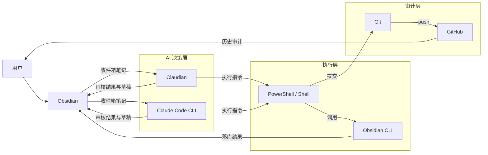
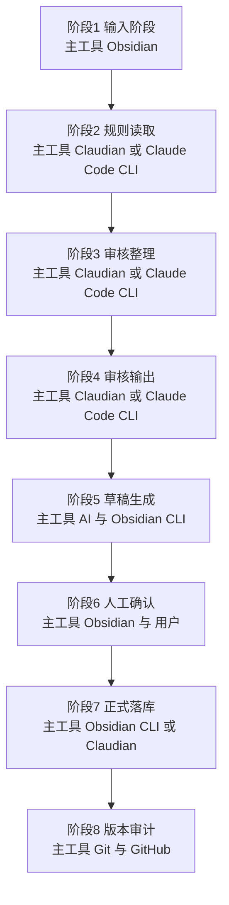

# 工具调用架构图与分阶段职责图

> 适用范围：第二大脑系统 MVP（收件箱写作 → AI 审核整理 → 正式落库 → GitHub 审计）

## 1. 总原则

- AI 负责判断（分类、归类、风险、降级）
- 工具负责执行（搜索、创建、追加、打开、提交）
- GitHub 负责审计（留痕、对比、回滚）
- Obsidian 负责承载内容（输入、阅读、确认）

## 2. 工具清单与角色

| 工具 | 角色 | 主职责 |
|------|------|--------|
| Obsidian | 主界面 | 写收件箱、看审核结果、人工确认 |
| Claudian | Obsidian 内 AI 工作台 | 读取规则与笔记、输出审核结果、生成草稿 |
| Claude Code CLI | 仓库级 AI 代理 | 批量处理、文件级修改、流程衔接 |
| Obsidian CLI | 执行层 | search/open/create/append/daily_append |
| PowerShell / Shell | 编排层 | 串联 AI 输出与 CLI 执行 |
| Git / GitHub | 审计层 | 分阶段提交、远程备份、回滚 |

## 3. 工具调用架构图

## 4. 分阶段职责图

## 5. 分阶段工具矩阵

| 阶段 | 主要工具 | 关键动作 | 是否自动 |
|------|----------|----------|----------|
| 阶段1 输入 | Obsidian | 收件箱模板写作 | 手动 |
| 阶段2 规则读取 | Claudian / Claude Code CLI | 读取规则文件与当前笔记 | 自动 |
| 阶段3 审核整理 | Claudian / Claude Code CLI | 分类、目录候选、frontmatter 草稿、风险判断 | 自动 |
| 阶段4 审核输出 | Claudian / Claude Code CLI + Obsidian | 输出标准审核回执并展示 | 自动 |
| 阶段5 草稿生成 | AI + Obsidian CLI | create/append/open/daily_append | 半自动 |
| 阶段6 人工确认 | Obsidian + 用户 | 确认高风险动作（移动、正文插链、更新正式笔记） | 手动 |
| 阶段7 正式落库 | Obsidian CLI / Claudian / Claude Code CLI | 执行确认后的结构性动作 | 半自动 |
| 阶段8 审计 | Git / GitHub | 三段提交、push、回滚 | 半自动 |

## 6. MVP 最小工具组合

- Obsidian
- Claudian
- Obsidian CLI
- Git/GitHub

> 先跑审核模式，不直接全自动。

## 7. MVP 推荐调用顺序

1. Obsidian：写入 `01-收件箱/`。
2. Claudian：读取规则并产出审核结果。
3. Obsidian CLI：搜索目标笔记、创建草稿、追加日志。
4. 用户：在 Obsidian 中确认高风险动作。
5. Obsidian CLI 或 Claudian：执行确认动作。
6. Git/GitHub：按三段策略提交。

## 8. 三段提交策略（建议）

- `note(inbox): add raw note`
- `ai-draft: generate structured draft`
- `ai-reviewed: apply approved actions`

## 9. 与现有文档的关系

- 规则：`00-系统/AI整理规则.md`
- 质检：`00-系统/整理检查清单.md`
- 审核输出：`00-系统/审核模式输出格式.md`
- 执行命令流：`00-系统/ObsidianCLI+AI审核模式-命令流与目录约定.md`
- 执行脚本：`00-系统/scripts/obsidian-review-flow.ps1`、`00-系统/scripts/git-review-flow.ps1`

